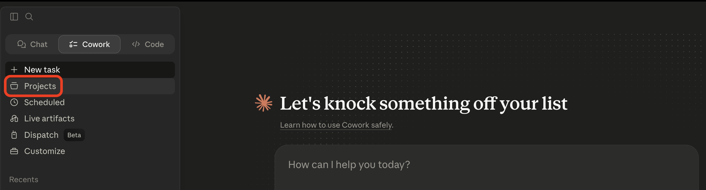
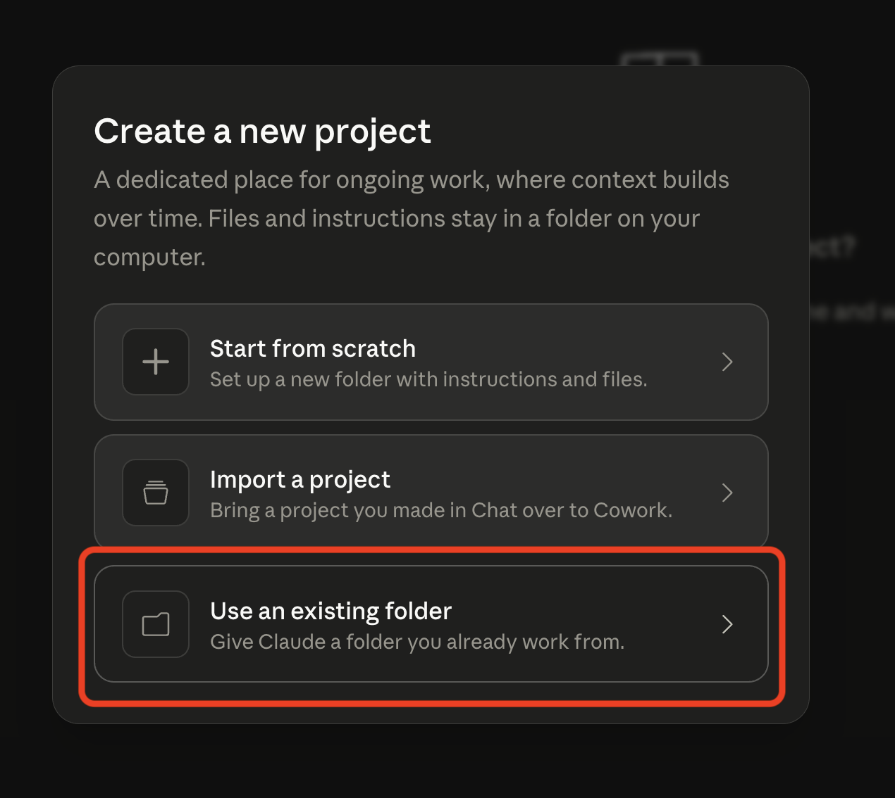
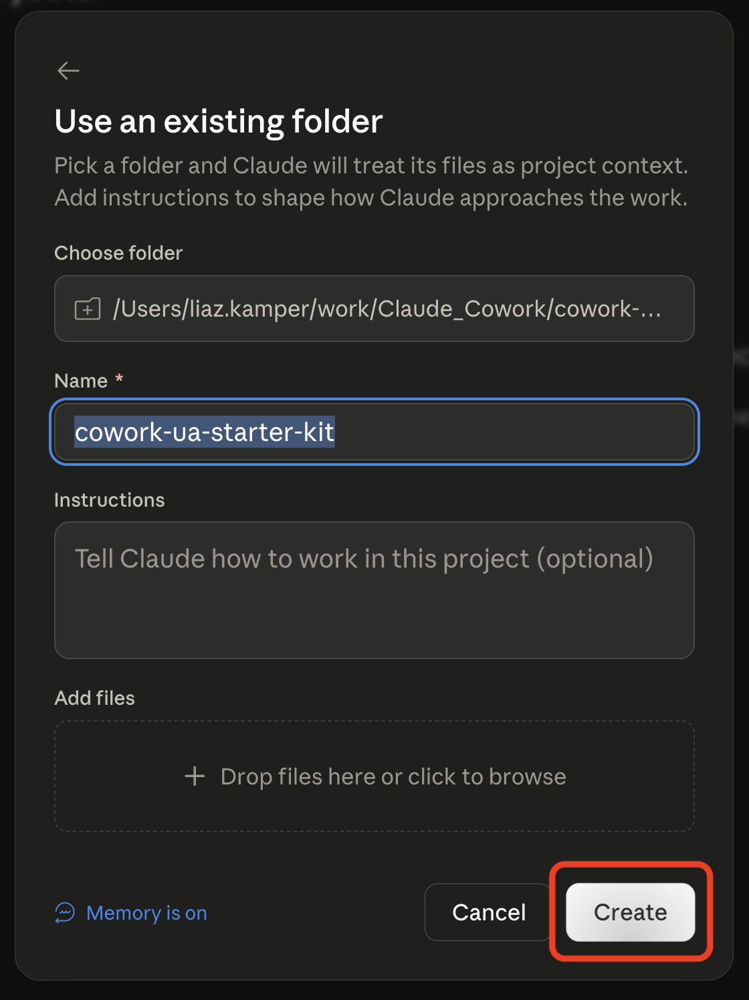
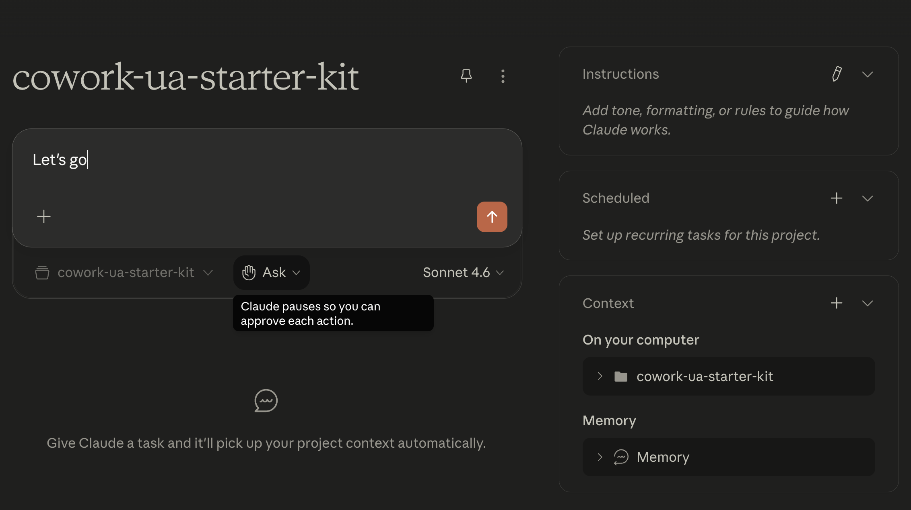

# AppsFlyer Cowork Starter Kit Setup Guide

This guide walks you through the process of downloading and configuring the AppsFlyer Cowork Starter Kit in Claude Desktop.

## Overview

The AppsFlyer Cowork Starter Kit gives growth marketing teams a ready-to-use Cowork project for working with AppsFlyer data through MCP. Drop it into Cowork as an existing folder, say *Let's go*, and Claude handles the rest.

## Prerequisites

- Claude Desktop app with Cowork mode enabled
- AppsFlyer MCP connector added in Cowork (authentication is handled via OAuth — sign in once when prompted, no token to copy or paste). 
- The starter kit [zip file](https://raw.githubusercontent.com/AppsFlyerKnowledge/appsflyer-ai-agents-examples/refs/heads/main/Claude/AppsFlyer%20Cowork%20Starter%20Kit/appsflyer-cowork-starter-kit.zip)

## Setup

### Step 1: Download and Unzip the Starter Kit

1. Download the [starter kit zip](https://raw.githubusercontent.com/AppsFlyerKnowledge/appsflyer-ai-agents-examples/refs/heads/main/Claude/AppsFlyer%20Cowork%20Starter%20Kit/appsflyer-cowork-starter-kit.zip).

2. Unzip it somewhere on your machine you'll remember — for example, `~/work/appsflyer-cowork-starter-kit`.

### Step 2: Open Cowork and Go to Projects

In Claude Desktop, switch to **Cowork** mode and click **Projects** in the left sidebar.

### Step 3: Create a New Project

Click **New project** to start the project setup flow.

### Step 4: Choose "Use an existing folder"

You want Claude to work with the folder you just unzipped, not start from scratch. Pick **Use an existing folder**.

### Step 5: Point Claude at the Unzipped Folder

1. Click **Choose folder** and select the `appsflyer-cowork-starter-kit` folder you unzipped in Step 1.
2. Leave the **Name** as `appsflyer-cowork-starter-kit` (or rename it to whatever you prefer).
3. Click **Create**.

### Step 6: Start Working with Claude

Your project is ready. Type **`Let's go`** and Claude will take you through everything from here — no further manual setup needed.

## Customizing and Questioning Your Agents

The starter kit is a starting point, not a fixed template:

- **Customize any agent after it's created.** Tell Claude what you'd like changed — output format, thresholds, media sources to focus on, reporting cadence — and it will adjust the agent for you.
- **Question Claude's reasoning at any time.** If an agent's conclusion, number, or recommendation doesn't look right, ask Claude to explain where it came from, show its sources, or rerun the analysis differently. Treat every output as something you can interrogate, not a black box.

## Troubleshooting

- Make sure the AppsFlyer MCP connector is added and signed in (OAuth) before saying *Let's go*.
- If Claude can't see the starter kit files, re-open the project and confirm the folder path under **Context → On your computer** is correct.
- If an agent returns no data, double-check the app and date range against what's actually live in your AppsFlyer account.

---
