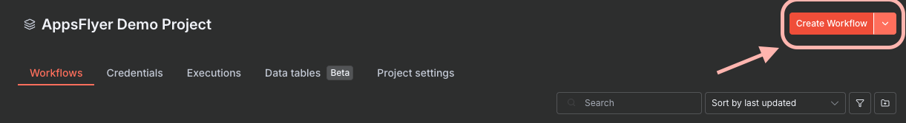
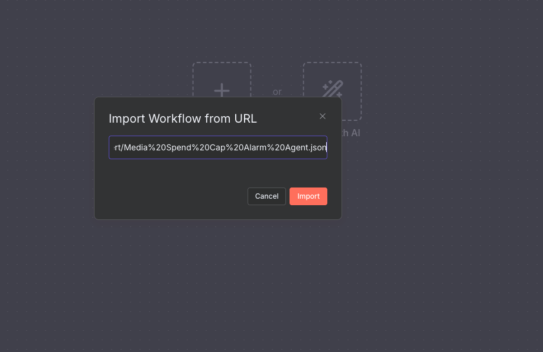
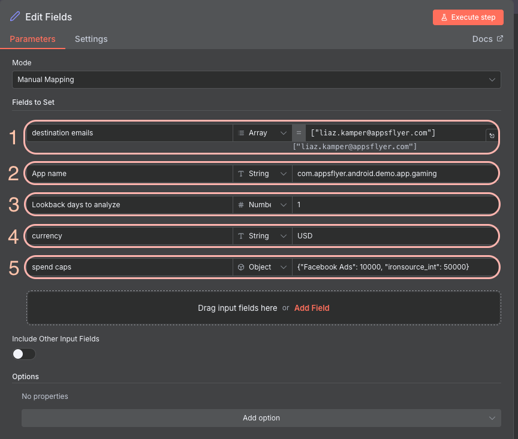
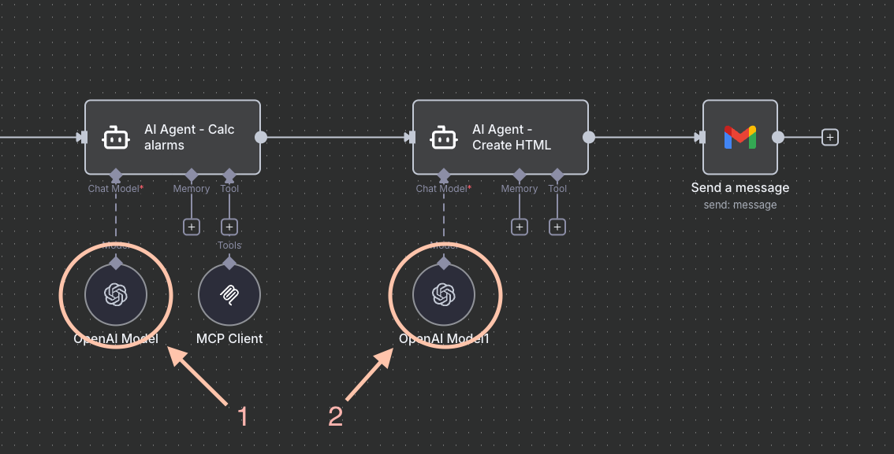
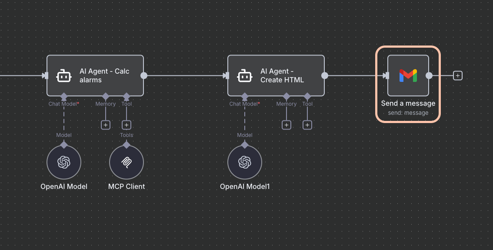
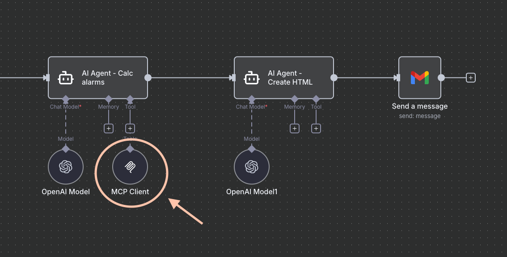

# Media Spend Cap Alarm Agent n8n Flow Setup Guide

This guide walks you through the process of importing and configuring the AppsFlyer Media Spend Cap Alarm Agent n8n flow from GitHub.

## Overview

The Media Spend Cap Alarm Agent monitors your media source spending and automatically alerts you when spending approaches predefined caps. The AI agent uses AppsFlyer MCP to check current spending across media sources and campaigns, and sends email alerts when spending reaches 75% or 90% of configured caps.

## Prerequisites

- An n8n account and workspace access
- AppsFlyer MCP token
- OpenAI API key
- Gmail account for sending alerts
- GitHub repository URL containing the n8n flow [JSON file](https://raw.githubusercontent.com/AppsFlyerKnowledge/appsflyer-ai-agents-examples/refs/heads/main/n8n/caps_alert/Media%20Spend%20Cap%20Alarm%20Agent.json)

## Import Flow from GitHub

### Step 1: Create or Access Your n8n Workspace

Before importing the flow, ensure you have a workspace set up in n8n.

### Step 2: Import the Flow from GitHub URL

1. In your n8n dashboard, click on the **Import** option (usually found in the top menu or sidebar).

2. Select **Import from URL** to import the flow directly from your GitHub repository.

3. Click on the URL input field to enter your GitHub raw file URL.

4. Paste your GitHub raw file URL: `https://raw.githubusercontent.com/AppsFlyerKnowledge/appsflyer-ai-agents-examples/refs/heads/main/n8n/caps_alert/Media%20Spend%20Cap%20Alarm%20Agent.json` and click **Import**.

### Step 3: Configure Flow Fields

After importing the flow, you'll need to configure various fields and credentials.

1. Double-click the **Edit Fields** node.

2. Update the necessary fields with your specific values and configurations:
   - **App name**: Your app ID (e.g., `com.appsflyer.android.demo.app.gaming`)
   - **Lookback days to analyze**: Number of days to look back (default: 1)
   - **currency**: Currency code (e.g., `USD`)
   - **spend caps**: JSON object with media source names and their caps (e.g., `{"Facebook Ads": 10000, "ironsource_int": 50000}`)
   - **destination emails**: Array of email addresses to receive alerts

### Step 4: Configure Credentials

The flow requires several credentials to function properly. Set up each one as follows:

#### OpenAI Credentials

1. Navigate to the OpenAI node in your flow and configure the credentials.

2. Click to create a new OpenAI token.

3. Enter your OpenAI API key in the dialog.

#### Gmail Credentials

1. Navigate to the Gmail node in your flow and configure the credentials.

2. Click to create a new Gmail token.

3. Enter your Gmail credentials in the dialog.

#### MCP (Model Context Protocol) Credentials

1. Navigate to the MCP Client node in your flow and configure the credentials.

2. Click to create a new MCP token.

3. Enter your MCP token in the dialog.

## How It Works

1. **Data Collection**: The AI agent uses AppsFlyer MCP to fetch aggregated spending data grouped by media source and campaign for the specified lookback period.

2. **Threshold Detection**: The agent compares total spending per media source against configured caps:
   - **75% threshold**: Warning alert when spending reaches 75% of cap
   - **90% threshold**: Critical alert when spending reaches 90% of cap

3. **Alert Generation**: When thresholds are crossed, the agent generates structured JSON alerts with:
   - Media source name
   - Current spend vs. cap
   - Percentage of cap reached
   - Campaign breakdown

4. **HTML Formatting**: A second AI agent converts the alert JSON into a formatted HTML email with:
   - Color-coded alert badges (amber for 75%, red for 90%)
   - Campaign spending breakdown tables
   - Summary of non-capped and uncapped media sources

5. **Email Delivery**: The formatted HTML alert is sent to the configured email addresses.

## Next Steps

After completing the setup:

1. Save your flow
2. Test the workflow by running it manually
3. Configure the spend caps for your media sources in the **Edit Fields** node
4. Activate the workflow if you want it to run automatically on a schedule

## Troubleshooting

- Ensure all credentials are properly configured
- Verify that your GitHub URL points to the correct raw file
- Check that all required nodes have valid connections
- Review n8n logs for any error messages
- Verify that your spend caps JSON format is correct: `{"Media Source Name": cap_amount}`
- Ensure your AppsFlyer MCP token has access to the specified app data

---

**Author:** Liaz Kamper

