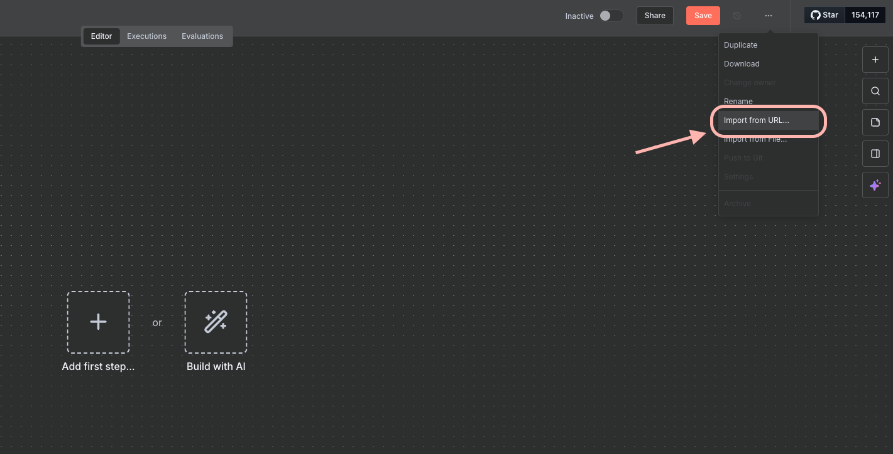
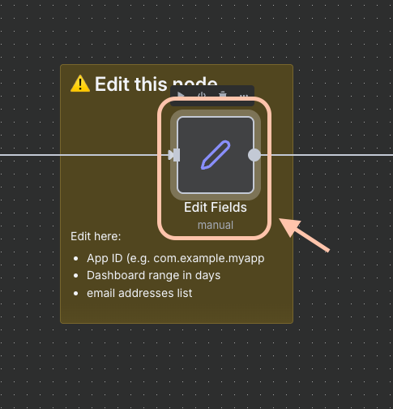
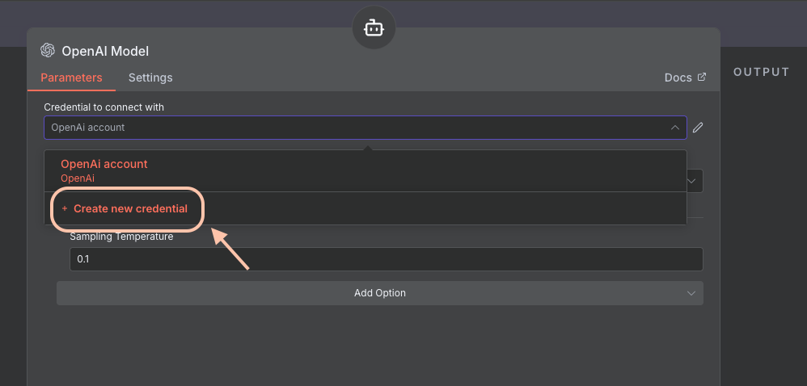
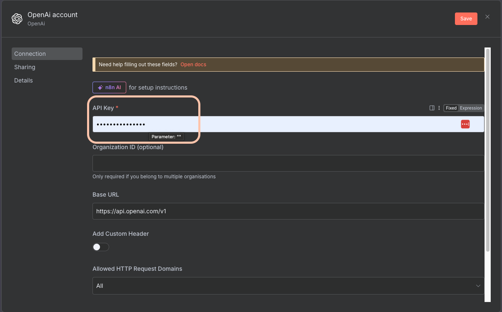
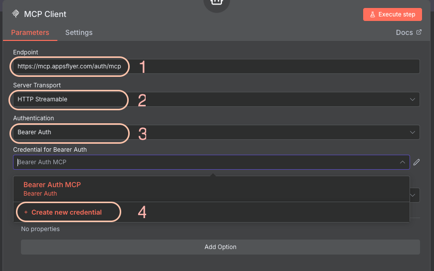

# Executive Summary n8n Flow Setup Guide

This guide walks you through the process of importing and configuring AppsFlyer Executive Summary n8n flow from GitHub.

## Prerequisites

- An n8n account and workspace access
- AppsFlyer MCP token
- GitHub repository URL containing the n8n flow [JSON file](https://raw.githubusercontent.com/AppsFlyerKnowledge/appsflyer-ai-agents-examples/refs/heads/main/n8n/executive_summary/executive_summary_agent_gmail.json)

## Import Flow from GitHub

### Step 1: Create or Access Your n8n Workspace

Before importing the flow, ensure you have a workspace set up in n8n.

### Step 2: Import the Flow from GitHub URL

1. In your n8n dashboard, click on the **Import** option (usually found in the top menu or sidebar).

2. Select **Import from URL** to import the flow directly from your GitHub repository.

3. Click on the URL input field to enter your GitHub raw file URL.

4. Paste your GitHub raw file URL: `https://raw.githubusercontent.com/AppsFlyerKnowledge/appsflyer-ai-agents-examples/refs/heads/main/n8n/executive_summary/executive_summary_agent_gmail.json` and click **Import**.

### Step 3: Configure Flow Fields

After importing the flow, you'll need to configure various fields and credentials.

1. Double-click the **Edit Fields** node.

2. Update the necessary fields with your specific values and configurations.

### Step 4: Configure Credentials

The flow requires several credentials to function properly. Set up each one as follows:

#### OpenAI Credentials

1. Navigate to the OpenAI node in your flow and configure the credentials.

2. Click to create a new OpenAI token.

3. Enter your OpenAI API key in the dialog.

#### Gmail Credentials

1. Navigate to the Gmail node in your flow and configure the credentials.

2. Click to create a new Gmail token.

3. Enter your Gmail credentials in the dialog.

#### MCP (Model Context Protocol) Credentials

1. Navigate to the MCP Client node in your flow and configure the credentials.

2. Click to create a new MCP token.

3. Enter your MCP token in the dialog.

## Next Steps

After completing the setup:

1. Save your flow
2. Test the workflow by running it manually
3. Activate the workflow if you want it to run automatically

## Troubleshooting

- Ensure all credentials are properly configured
- Verify that your GitHub URL points to the correct raw file
- Check that all required nodes have valid connections
- Review n8n logs for any error messages

---

**Author:** Liaz Kamper
